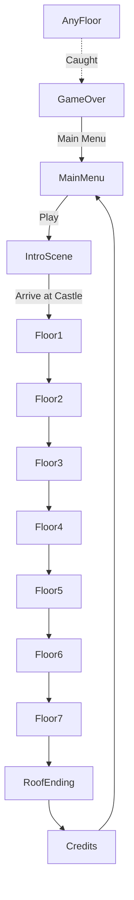

# Architecture Summary — Pixel Horror Castle

> Deliverable 2 of the implementation roadmap. Derived strictly from `AGENT.md`, `docs/architecture.md`,
> `docs/decisions.md`, `docs/technical-requirements.md`, and `docs/coding-style.md`.
> Summary only — no new mechanics, no redesign.

---

## 1. Engine, Platform & Rendering

| Aspect | Decision | Source |
|--------|----------|--------|
| Engine | Godot 4.x (ADR-001 states 4.7), GDScript | decisions.md, technical-requirements.md |
| Platform | PC / Steam; export Windows 10/11 x86_64 (SSE4.2) | project.md, technical-requirements.md |
| Base resolution | 320×180 (16:9) | project.md, ADR-003 |
| Pixel fidelity | Nearest-neighbor filtering, integer scaling, pixel-perfect viewport | ADR-004, technical-requirements.md |
| Camera / view | Top-down orthographic | ADR-002 |
| Target FPS | 60 (physics FPS 60) | project.md, technical-requirements.md |
| Memory budget | < 500 MB; scene load < 3 s | technical-requirements.md |
| Lighting | Godot 2D lighting: `Light2D`, `CanvasModulate`; cache shaders, limit light sources | technical-requirements.md, architecture.md |

---

## 2. Architectural Principles (from AGENT.md + coding-style.md)

- Keep systems **modular**.
- Keep gameplay **deterministic**.
- Keep **rendering separated from gameplay**.
- Keep **UI separated from logic**.
- **Prefer existing architecture**; never duplicate code; never over-engineer; no unnecessary abstractions.
- **Composition over inheritance**; avoid deep inheritance.
- **No magic** numbers/strings — all tunables exported or driven by config.
- Use **signals** for event callbacks.
- Naming: `snake_case` for files/functions/vars, `PascalCase` for classes/nodes, `_` prefix for private/virtual.
- Functions concise (≤ ~50 lines); single responsibility per class.
- Missing assets → clearly named placeholders + `TODO`.

---

## 3. Layered Architecture

```
┌─────────────────────────────────────────────────────────────┐
│ Presentation Layer:  UI / HUD / Menus  •  Audio               │  (separated from logic)
├─────────────────────────────────────────────────────────────┤
│ Rendering Layer:     Lighting (Light2D, CanvasModulate)       │  (separated from gameplay)
│                      Camera2D                                  │
├─────────────────────────────────────────────────────────────┤
│ Gameplay Layer:      Player • Monster AI • Stealth            │
│                      Interaction • Inventory • Items/Artifacts │
│                      Merchant • Furniture • Loot • Doors       │
├─────────────────────────────────────────────────────────────┤
│ World Layer:         Procedural Generation • Rooms • TileMap   │
├─────────────────────────────────────────────────────────────┤
│ Core Framework:      GameManager • SceneLoader • SignalBus*    │
│                      Config* • SaveManager • BaseEntity*       │
├─────────────────────────────────────────────────────────────┤
│ Foundation:          Input layer  •  Project structure  •  CI │
└─────────────────────────────────────────────────────────────┘
* SignalBus, Config, BaseEntity are recommended additions (see Deliverable 1, §10).
```

Rule: each layer may depend only on layers below it. Gameplay never reaches into Presentation directly —
it emits signals consumed by UI/Audio.

---

## 4. Core Managers (Autoloads)

| Manager | Responsibility | Notes |
|---------|----------------|-------|
| `GameManager` | Start game, advance floors, track achievements, handle game over, trigger saves | architecture.md §2 |
| `SceneLoader` | Load/unload/transition scenes (menu ↔ intro ↔ floors ↔ ending) | architecture.md §3 |
| `SaveManager` | JSON serialize/deserialize; regenerate floor from seed; restore state | save-system.md |
| `SignalBus` *(recommended)* | Global event bus to decouple Player / Monster / UI / Audio | Deliverable 1 §10 |
| `Config` *(recommended)* | All tunable constants / data-table access (no magic numbers) | coding-style.md |
| `AudioManager` | Category buses (Music / Ambient / SFX / UI); variable-intensity cues | technical-requirements.md |

---

## 5. Scene Flow



- **MainMenu.tscn:** animated rainy forest, Rain particles, parallax forest BG; buttons Play / Exit; single-entry enforced.
- **IntroScene.tscn:** boy walks forest → castle; fade to black → Floor1.
- **Floor<n>.tscn:** `Floor` root → TileMap, instanced Room scenes, Player (fixed entrance spawn),
  Camera2D (clamped to floor bounds), CanvasLayer/HUD.
- **RoofEnding.tscn:** static scene, boy on roof, moon, credits text.
- **GameOver:** red overlay → Main Menu / Quit.

> Conflict flag: architecture.md labels `RoofEnding → Credits` as "Game Over"; vision/ui treat the roof as
> the win state. Diagram above reflects the intended win path (roof = victory). C7 resolved: roof = win.

---

## 6. Node & Scene Architecture

| Scene | Root type | Key children |
|-------|-----------|--------------|
| `Player.tscn` | KinematicBody2D/CharacterBody2D | Sprite, CollisionShape, Light2D (lantern), interaction area |
| `Monster.tscn` | CharacterBody2D | Sprite, CollisionShape, detection area, A* agent |
| `Merchant.tscn` | Node2D | Sprite (translucent), dialogue/trade area |
| `Chest.tscn` | Node2D | Sprite, interaction area, unique ID |
| `HUD.tscn` | CanvasLayer | oil meter, coin counter, artifact icons, prompts, alert overlay |
| `Floor.tscn` | Node2D (`Floor`) | TileMap, Room instances, Player, Camera2D, HUD layer |

---

## 7. Event / Signal Flow (from architecture.md §3)

```
Input ──▶ PlayerController ──▶ Lantern (light radius)
                          ├──▶ InteractionController
                          └──▶ InventoryManager ──▶ UIManager
MonsterAI ──▶ HeartbeatSound (Audio)
PlayerController ──(signal: damage)──▶ UIManager
SaveManager ──▶ GameManager ──▶ SceneLoader
```

Recommendation: route these through `SignalBus` rather than direct references to satisfy the
"UI separated from logic" and "modular" principles.

---

## 8. Data & Persistence

- **Format:** JSON (ADR-005), human-readable, versioned schema (`version` field).
- **Save trigger:** autosave on floor ascent only; no death saves; no manual save.
- **File naming:** one JSON per slot (`save_floor#.json` per technical-requirements.md).
- **Determinism:** floor regenerated from stored `random_seed` + `current_floor`; `opened_chests` and
  `opened_doors` re-applied so looted/unlocked state persists (save-system.md).
- **Requirement:** all RNG must be seeded from the stored seed to preserve deterministic replay.

---

## 9. Cross-Cutting Concerns

- **Localization:** `tr()` / `tr_n()` for all UI text; EN first, RU planned (technical-requirements.md).
- **Audio categories:** Master / Music / Ambient / SFX / UI; 44.1 kHz WAV/OGG; no hardcoded volumes.
- **Input map:** keyboard + controller actions (move, run, interact, lamp toggle, hide, pause, confirm/cancel).
- **CI / quality:** builds & runs, no script errors/warnings, lint/static analysis; docs kept in VCS.
- **Third-party:** minimize dependencies; built-in nodes preferred; plugins must be approved/licensed.

---

## 10. Folder Structure (target, from architecture.md §5 + recommended additions)

```
PixelHorrorCastle/
├── AGENT.md
├── README.md            # TODO: missing, to be authored
├── project.godot
├── scenes/              # .tscn files (menus, floors, entities, rooms, furniture, ui)
├── scripts/             # .gd files (controllers, managers, systems, base classes)
├── assets/              # sprites/, audio/, tilesets/, fonts/
├── data/                # recommended: items.json, loot.json, monsters.json, config
└── docs/                # design + architecture documentation
```

---

## 11. Previously Flagged Deviations (now resolved)

These recommendations from the original analysis have been implemented:

1. ✅ SignalBus, Config, BaseEntity autoloads/classes — implemented.
2. ✅ `data/` folder for data-driven tables — created with `data/items.json`.
3. ✅ `README.md` and `docs/world.md` — authored (resolves C1).
4. ✅ Godot 4 `@export` syntax — standardized (resolves C2).
5. ✅ Roof treated as win state — scene flow updated (resolves C7).

For all resolved documentation conflicts, see `docs/conflicts-log.md`.
