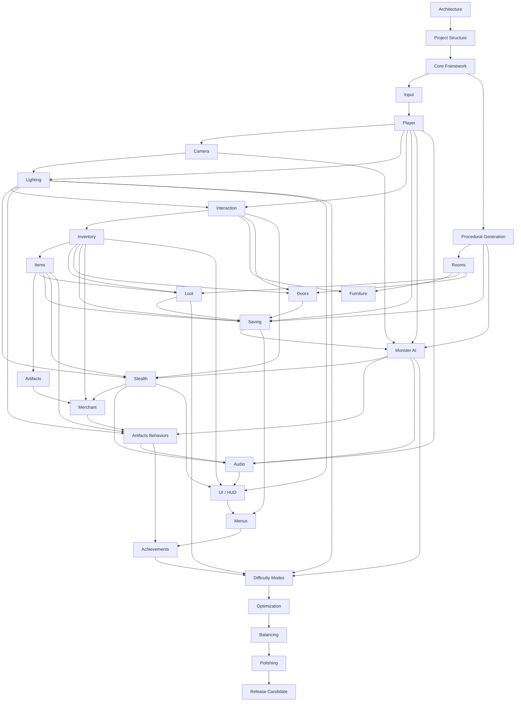

# Dependency Graph — Pixel Horror Castle

> Deliverable 4 of the implementation roadmap. Defines the build-order dependencies between all systems.
> Derived from `docs/architecture.md` (§2, §3), the analysis (Deliverable 1), and the required order.
> A system may only be implemented after every system it depends on is complete.

---

## 1. Master Dependency Graph (DAG)

```
Architecture
    │
    ▼
Project Structure
    │
    ▼
Core Framework ───────────────┐
    │                         │
    ▼                         │
Input                         │
    │                         │
    ▼                         │
Player ◀──────────────────────┘
    │
    ├──────────────▶ Camera
    ├──────────────▶ Lighting ◀── Camera
    └──────────────▶ Interaction ◀── Lighting
                          │
                          ▼
                     Inventory
                          │
                          ▼
                       Items
                          │
                          ▼
                     Artifacts ──────────────┐
                                             │
Procedural Generation (needs Core Framework) │
    │                                         │
    ▼                                         │
Rooms                                         │
    ├──────────────▶ Furniture ◀── Interaction│
    ├──────────────▶ Loot ◀── Inventory, Items│
    └──────────────▶ Doors ◀── Inventory, Interaction
                          │
                          ▼
Saving ◀── Player, Inventory, Items, Generation, Loot, Doors
    │
    ▼
Monster AI ◀── Player, Camera, Generation, Saving
    │
    ▼
Stealth ◀── Monster AI, Lighting, Interaction, Items
    │
    ▼
Merchant ◀── Items, Artifacts, Inventory, Monster AI
    │
    ▼
Artifacts (behaviors) ◀── Items, Stealth, Lighting, Monster AI
    │
    ▼
Audio ◀── Player, Monster AI, Stealth, Inventory, Core Framework
    │
    ▼
UI (HUD) ◀── Inventory, Lighting, Stealth, Interaction, Core Framework
    │
    ▼
Menus ◀── UI, Audio, Saving, Core Framework
    │
    ▼
Achievements ◀── Artifacts, Menus, Saving
    │
    ▼
Difficulty Modes ◀── Artifacts, Lighting, Monster AI, Loot, Saving
    │
    ▼
Optimization ◀── (all gameplay + rendering systems)
    │
    ▼
Balancing ◀── Difficulty Modes, Optimization
    │
    ▼
Polishing ◀── Optimization, Balancing
    │
    ▼
Release Candidate ◀── Polishing (integration of everything)
```

---

## 2. Mermaid Diagram



---

## 3. Dependency Table

| # | System | Direct Dependencies | Depended On By |
|---|--------|---------------------|----------------|
| 1 | Architecture | — | Project Structure |
| 2 | Project Structure | Architecture | Core Framework |
| 3 | Core Framework | Project Structure | Input, Generation, everything |
| 4 | Input | Core Framework | Player |
| 5 | Player | Input, Core Framework | Camera, Lighting, Interaction, Saving, Monster AI, Audio |
| 6 | Camera | Player | Lighting, Monster AI |
| 7 | Lighting | Player, Camera | Interaction, Stealth, Artifacts, UI, Difficulty |
| 8 | Interaction | Player, Lighting | Inventory, Furniture, Doors, Stealth |
| 9 | Inventory | Interaction | Items, Loot, Doors, Saving, Merchant, UI |
| 10 | Items | Inventory | Artifacts, Loot, Saving, Stealth, Merchant |
| 11 | Procedural Generation | Core Framework | Rooms, Saving, Monster AI |
| 12 | Rooms | Procedural Generation | Furniture, Loot, Doors |
| 13 | Furniture | Rooms, Interaction | Stealth (hide spots), Loot |
| 14 | Loot | Rooms, Inventory, Items | Saving, Difficulty |
| 15 | Doors | Rooms, Inventory, Interaction | Saving |
| 16 | Saving | Player, Inventory, Items, Generation, Loot, Doors | Monster AI, Menus, Difficulty, Achievements |
| 17 | Monster AI | Player, Camera, Generation, Saving | Stealth, Merchant, Audio, Difficulty |
| 18 | Stealth | Monster AI, Lighting, Interaction, Items | Merchant, Audio, UI |
| 19 | Merchant | Items, Artifacts, Inventory, Monster AI, Stealth | Artifacts behaviors |
| 20 | Artifacts | Items (defs) → Merchant, Stealth, Lighting, Monster AI (behaviors) | Audio, Achievements, Difficulty |
| 21 | Audio | Player, Monster AI, Stealth, Inventory, Core | UI |
| 22 | UI (HUD) | Inventory, Lighting, Stealth, Interaction, Audio, Core | Menus |
| 23 | Menus | UI, Audio, Saving, Core | Achievements |
| 24 | Achievements | Artifacts, Menus, Saving | Difficulty |
| 25 | Difficulty Modes | Artifacts, Lighting, Monster AI, Loot, Saving | Optimization |
| 26 | Optimization | All gameplay + rendering systems | Balancing |
| 27 | Balancing | Difficulty Modes, Optimization | Polishing |
| 28 | Polishing | Optimization, Balancing | Release Candidate |
| 29 | Release Candidate | Polishing (all systems integrated) | — |

---

## 4. Notes on Ordering

- **Items vs Artifacts split:** Item *definitions* (data + basic effects) are built with Items (#10).
  Artifact *behaviors* (#20) are finished after the systems they touch (Stealth, Lighting, Monster AI)
  exist, and after the Merchant that dispenses them. This split avoids scheduling work that depends on
  unfinished systems.
- **Saving before Monster AI:** kept per documentation. Save can capture player/floor/inventory state
  independently of monsters, enabling checkpoint testing before AI complexity is introduced. Monster
  transient state is not persisted (monsters regenerate from seed), so Saving has no dependency on
  Monster AI.
- **Core Framework feeds two branches:** the Player branch (Input → Player → …) and the World branch
  (Generation → Rooms → …). They converge at Saving.

---

## 5. Cycle Check

No cycles exist. Verified by topological ordering: the sequence 1 → 29 in the table above is a valid
topological sort — every system's dependencies appear strictly earlier in the list. Therefore the graph
is a valid DAG and the build order is safe.
